# 🏥 Hospital Management System

[](https://www.php.net/)
[](https://www.mysql.com/)
[](https://www.apachefriends.org/)
[](LICENSE)

A comprehensive, web-based **Hospital Management System** developed using **PHP** and **MySQL** for managing hospital operations efficiently. The system provides an interactive portal dashboard allowing administrators, medical staff, and receptionists to seamlessly manage patients, doctors, appointments, departments, rooms, staff members, prescriptions, lab reports, medical records, and surgeries.

---

## 🌟 Key Features

* **Patient Management**: Register new patient demographics, emergency contact details, and residential information.
* **Doctor Management**: Maintain records of clinical specialists, departments, contact numbers, and emails.
* **Appointment Scheduling**: Book and manage doctor consultations with specific dates, time slots, and medical visit reasons.
* **Department Administration**: Organize clinical divisions (Cardiology, Neurology, Pathology, Radiology) with designated building floors and Heads of Department.
* **Room & Bed Allocation**: Track room numbers, accommodation types (General, Private, ICU), and real-time availability status.
* **Staff Records**: Maintain clinical and administrative personnel records (Doctors, Nurses, Receptionists, and Admins).
* **Prescriptions**: Issue doctor prescriptions, medicine names, dosage directions, and prescription dates.
* **Lab Reports**: Document pathology and radiology test results, patient IDs, and examination dates.
* **Medical Records**: Maintain detailed historical records of patient clinical diagnoses, procedures, and prescribed treatments.
* **Surgery Scheduling**: Schedule surgical operations, procedures, assigned operating surgeons, and surgical notes.
* **Central Navigation Dashboard (`index.html`)**: Clean, responsive portal connecting all modules with single-click navigation.
* **Database Integration & CRUD Operations**: Robust MySQL database schema with MySQLi prepared statements to prevent SQL injection.

---

## 🛠️ Technologies Used

* **Backend**: PHP 8.x (MySQLi Object-Oriented with Prepared Statements)
* **Database**: MySQL (InnoDB Engine, utf8mb4)
* **Frontend**: HTML5, CSS3 (Clean responsive cards with custom visual color coding per module)
* **Server Environment**: XAMPP / WAMP / LAMP (Apache & MySQL)

---

## 📂 Project Structure

```text
Hospital Management System/
├── index.html                  # Main Hospital Management System Dashboard
├── database.sql                # Complete MySQL Database Schema & Sample Data
├── db.php                      # Centralized Database Connection Configuration
├── test_connection.php         # Database Connectivity Verification Test Page
│
├── add_patient.html            # Patient Registration Form
├── add_doctor.html             # Doctor Registration Form
├── add_department.html         # Clinical Department Form
├── add_appointment.html        # Outpatient Appointment Booking Form
├── add_staff.html              # Hospital Staff Management Form
├── add_room.html               # Room & Ward Allocation Form
├── add_prescription.html       # Patient Prescription Entry Form
├── add_lab_report.html         # Laboratory Diagnostic Report Form
├── add_medical_records.html    # Clinical Medical Records Form
├── add_surgeries.html          # Surgical Operation Scheduling Form
│
├── insert_patient.php          # Patient Insertion Handler (Prepared Statement)
├── insert_doctor.php           # Doctor Insertion Handler
├── insert_department.php       # Department Insertion Handler
├── insert_appointment.php      # Appointment Insertion Handler
├── insert_staff.php            # Staff Insertion Handler
├── insert_room.php             # Room Insertion Handler
├── insert_prescription.php     # Prescription Insertion Handler
├── insert_lab_report.php       # Lab Report Insertion Handler
├── insert_medical_record.php   # Medical Record Insertion Handler
└── insert_surgery.php          # Surgery Insertion Handler
```

---

## 🚀 Installation & Setup Guide

### 1. Prerequisites
* Install **[XAMPP](https://www.apachefriends.org/)** (or WAMP Server) on your computer.

### 2. Move Project to Web Root
1. Download or clone this repository:
   ```bash
   git clone https://github.com/armishiqbal/Hospital-Management-System.git
   ```
2. Move the `Hospital-Management-System` folder into your web server's root folder:
   * **Windows (XAMPP)**: `C:\xampp\htdocs\Hospital Management System\`
   * **macOS (XAMPP)**: `/Applications/XAMPP/xamppfiles/htdocs/Hospital Management System/`
   * **Linux (LAMP)**: `/var/www/html/Hospital Management System/`

### 3. Start Apache & MySQL
* Open the **XAMPP Control Panel** and click **Start** next to both **Apache** and **MySQL**.

### 4. Import Database (`database.sql`)
1. Open your browser and navigate to phpMyAdmin:
   ```text
   http://localhost/phpmyadmin/
   ```
2. Click the **Import** tab at the top.
3. Click **Choose File** and select `database.sql` from the project folder.
4. Click **Import** (or **Go**).
   *(This automatically creates the `hospital_management_system` database and all 10 required tables with sample records).*

### 5. Test Database Connection
Open your browser and verify the database link:
```text
http://localhost/Hospital%20Management%20System/test_connection.php
```

### 6. Launch the Application Dashboard
Access the main hospital portal:
👉 **`http://localhost/Hospital%20Management%20System/index.html`** (or `http://localhost/Hospital%20Management%20System/`)

---

## 📸 Screenshots

### Portal Dashboard (`index.html`) & phpMyAdmin SQL Query Execution
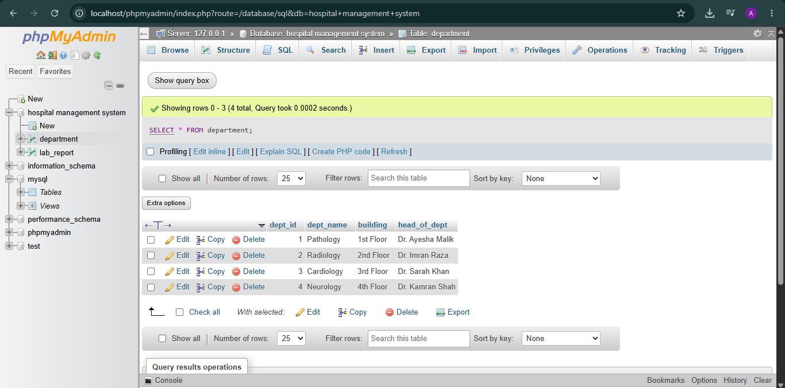

### Add Patient Page
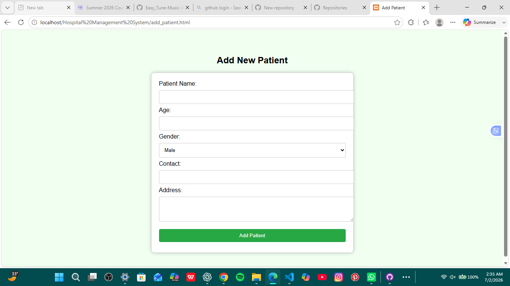

### Add Doctor Page
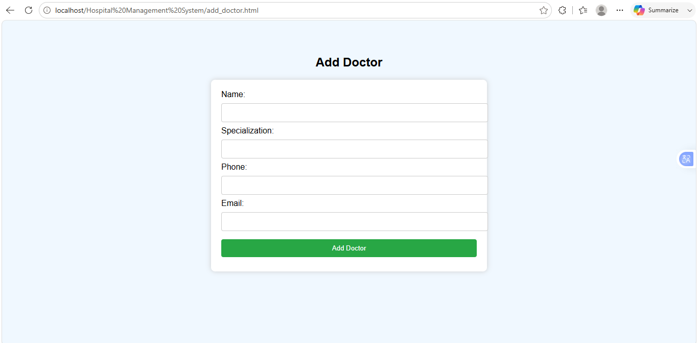

### Add Department Page
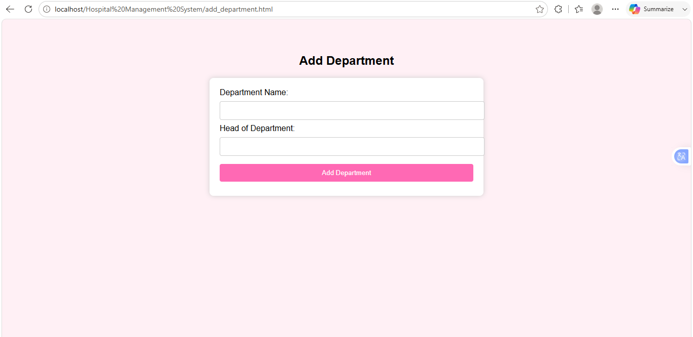

### Book Appointment Page
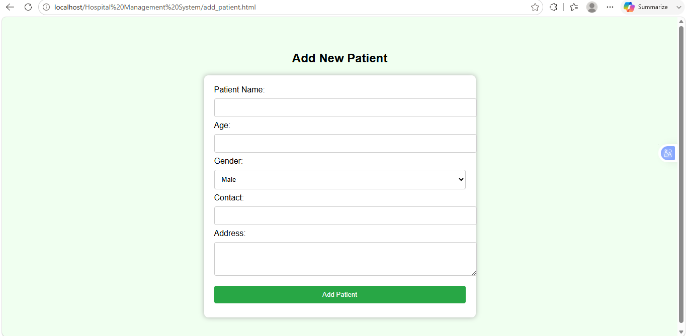

### Lab Report Form
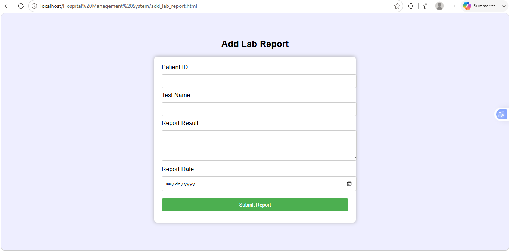

### Add Prescription Page
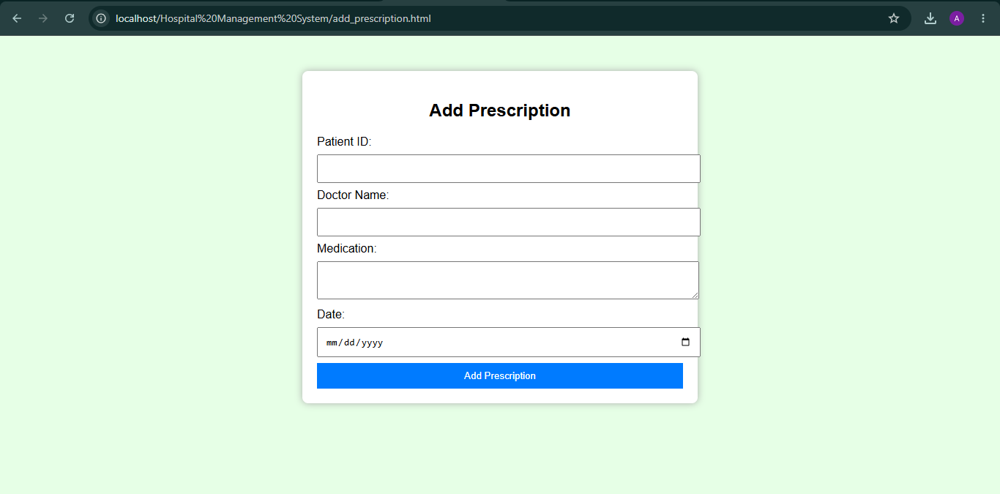

### Add Room Page
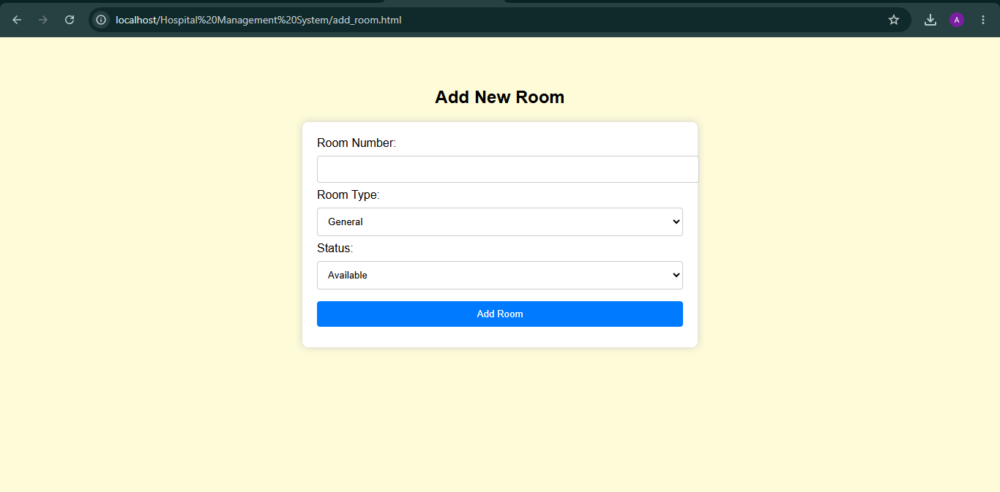

### Add Staff Member Page
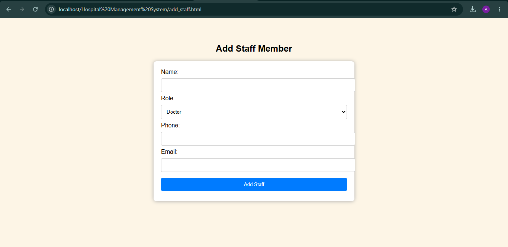

### Add Surgery Page
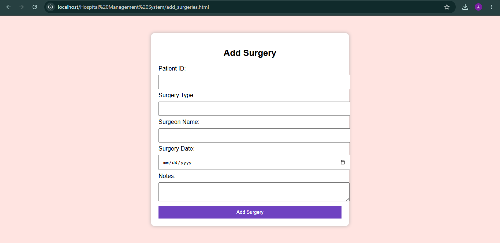

### Add Medical Record Page
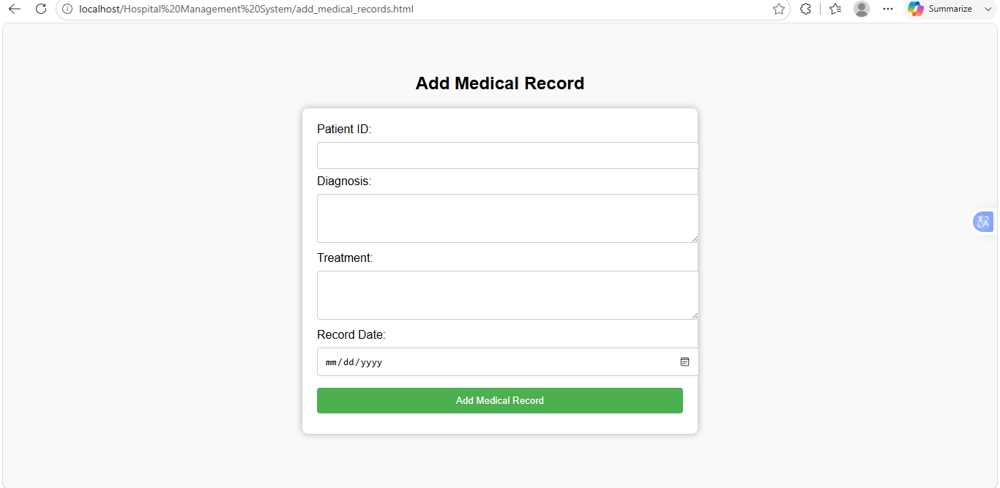

---

## 👩‍💻 Author

**Armish Iqbal**  
*BS Computer Science*  
*Islamia University Bahawalpur*  
*GitHub: [@armishiqbal](https://github.com/armishiqbal)*
